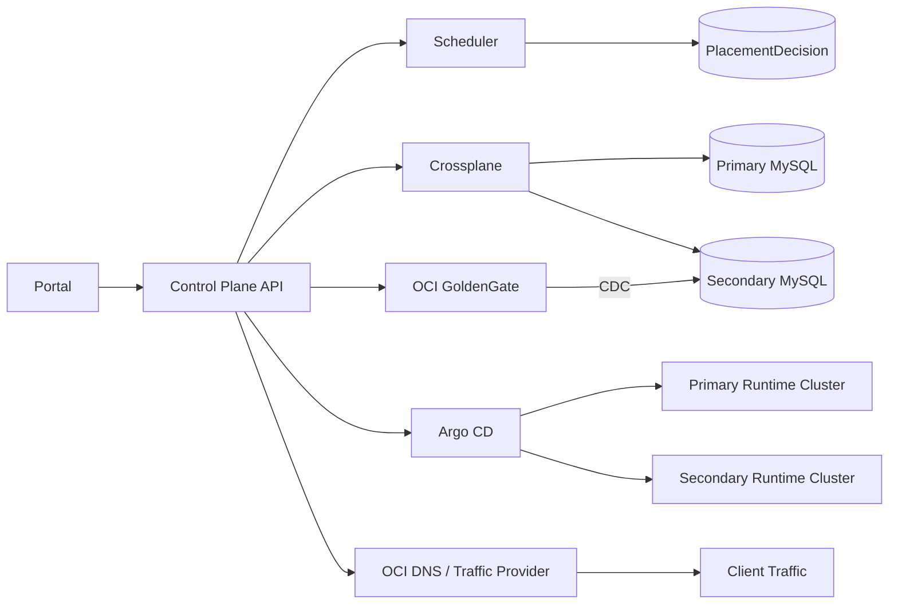
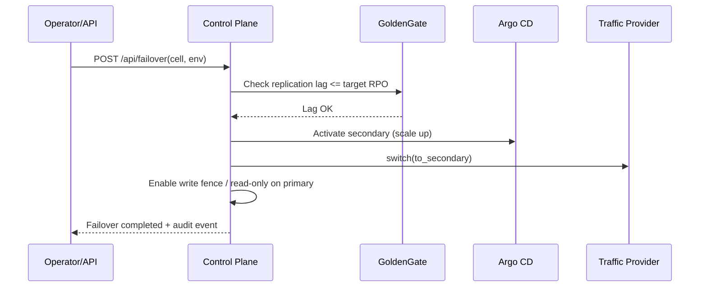

# idp-multicloud — Full Stack Multi-cloud DR IDP

## Objetivo
Este repositorio implementa un **Control Plane IDP cell-based** donde el developer solo define:
`cell + tier + env + size + storage + ha + drProfile` (y para app: image + host), sin elegir cloud/region/cluster.

El control plane decide y audita:
- Placement primario/secundario multi-cloud
- DR de datos (MySQL + OCI GoldenGate CDC)
- DR de compute (Argo CD multi-cluster con warm/pilot/cold)
- DR de tráfico (OCI DNS por defecto, pluggable a Cloudflare/Route53)

## Arquitectura

### A) Normal operation


### B) Failover flow


## Contratos Developer API
- `POST /api/mysql` → crea `CellMySQLClaim` primario/secundario + `ReplicationClaim`.
- `POST /api/app` → crea definición de `Application` ArgoCD primary/secondary según compute mode.
- `GET /api/status/{cell}/{env}` → estado agregado de claims + failover + traffic.
- `POST /api/failover` → runbook controlado.

## Tier y DR profiles
Policy versionada en `config/policy.yaml` define:
- Tiers `C0/C1/C2` (gates + weights + defaults)
- DR profiles `gold/silver/bronze`
- Cell registry y candidatos por cloud
- Capacidades por provider
- Provider de tráfico por defecto (`oci-dns`)

## Policy-as-data
Editar `config/policy.yaml` para:
1. Registrar nuevas celdas/candidatos
2. Cambiar weighting del scheduler
3. Forzar reglas cross-cloud
4. Cambiar traffic provider default sin tocar core

## Full-stack DR implementado
### Data
- Claims primario/secundario para MySQL managed
- `ReplicationClaim` modela source/target/tool/expectedRPO
- Plantillas OCI GoldenGate en `manifests/oci-goldengate/replication-template.yaml`

### Compute
- Plantillas Argo CD en `manifests/argocd/cell-applications-template.yaml`
- `computeMode`:
  - `warm`: secundaria activa mínima
  - `pilot`: manifests listos, replicas 0
  - `cold`: secundaria apagada/no activa

### Traffic
- Interface `TrafficProvider` en `internal/traffic/base.py`
- Implementación default OCI DNS: `internal/traffic/providers/oci_dns.py`
- Stubs: Cloudflare y Route53

## Operación de failover
Flujo:
1. Validación de recursos secundarios
2. Validación lag <= target RPO
3. Activación compute secundario
4. `switch()` de tráfico
5. Registro auditable
6. Write-fence (modo read-only conceptual)

## Cómo correr local
```bash
python -m venv .venv
source .venv/bin/activate
pip install -r requirements.txt
python cmd/controlplane/main.py
```
UI: `http://localhost:8080/`

## Ejemplos curl
```bash
curl -X POST localhost:8080/api/mysql -H 'content-type: application/json' -d '{"cell":"payments","environment":"prod","tier":"C0","drProfile":"gold","size":"small","storageGB":50,"ha":true}'

curl -X POST localhost:8080/api/app -H 'content-type: application/json' -d '{"cell":"payments","environment":"prod","tier":"C0","drProfile":"gold","app":{"image":"ghcr.io/acme/payments:1.0"},"traffic":{"publicHost":"payments.prod.company.com","mode":"active-passive"}}'

curl localhost:8080/api/status/payments/prod

curl -X POST localhost:8080/api/failover -H 'content-type: application/json' -d '{"cell":"payments","environment":"prod","host":"payments.prod.company.com"}'
```

## Crossplane/ArgoCD instalación (conceptual)
1. Instalar Crossplane core + providers cloud + ProviderConfig.
2. Aplicar CRDs internos DR: `manifests/crds/platform-dr-crds.yaml`.
3. Instalar Argo CD y registrar clusters destino.
4. Conectar secrets/credentials fuera de repo.

## Advertencias operativas
- Evitar split-brain: usar write-fence/read-only al conmutar writer.
- No exponer secretos por API.
- Monitorear lag GoldenGate y health checks DNS antes de failover.
- Ajustar apiVersion/kind de OCI GoldenGate según versión provider real.
